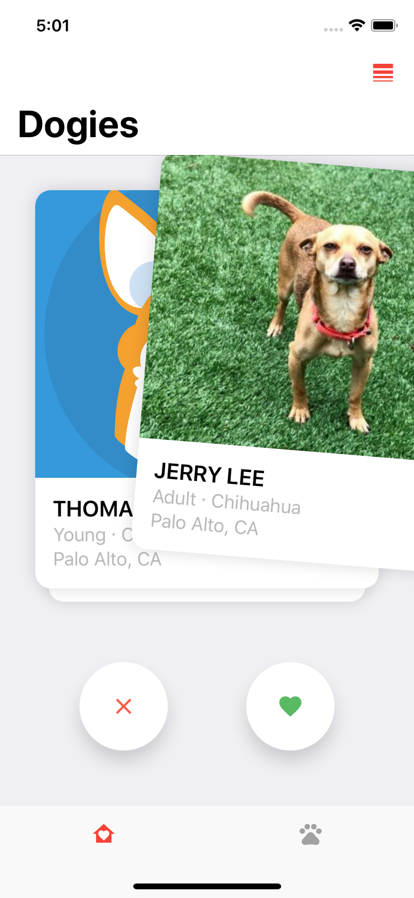
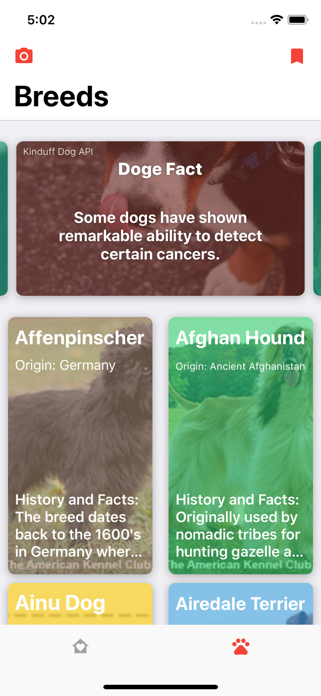
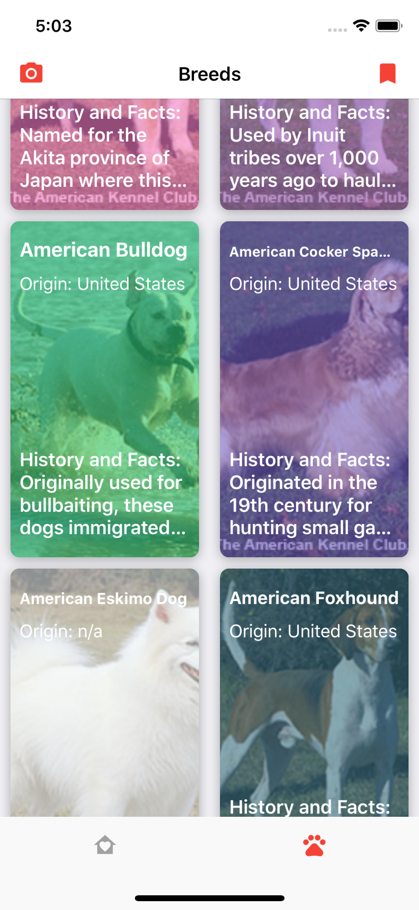
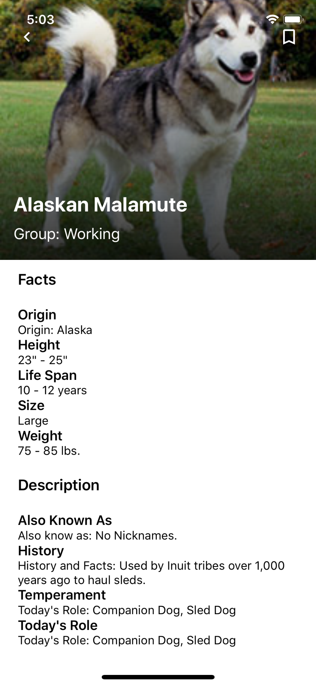
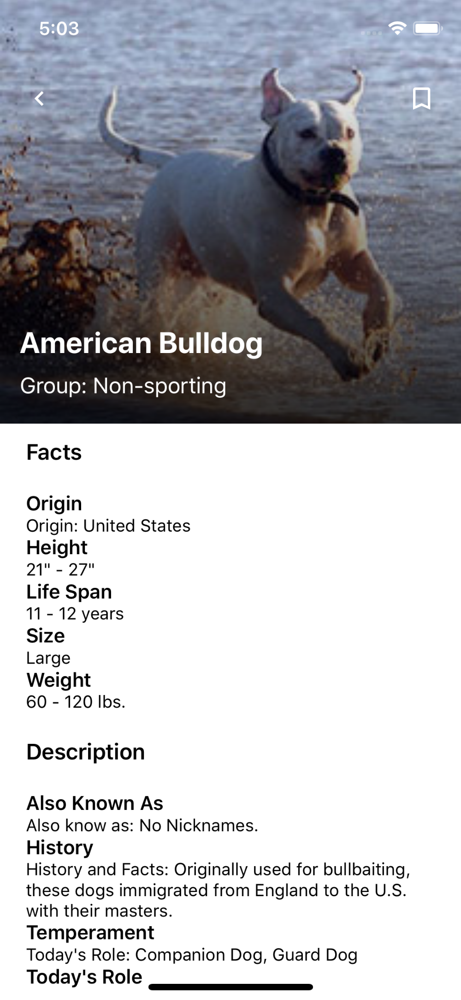

# DOGE BREEDS

> This project is apart of my individual final for my IOS class at Cogswell

An IOS app for adopting dogs in your area :)

* Random Dog Facts - [Kinduff Dog API](http://kinduff.com/dog-api/)
* List of Breeds - [Breeds](https://github.com/Cristian006/biljac-breeds)
* Adoptable Dogs - [Petfinder API](https://www.petfinder.com/developers/api-docs)

# Roadmap

There is definitely a lot more work to be done in terms of making this an actual published application but for the amount of time I put into it, I think it turned out okay.

### Accounts and all that fun stuff

This app is just a functional proof of concept at this point in time. Ideally this app would allow users to sign in, save the dogs that were swiped right on in a list, bookmark certain breeds from the breed list, and so much more...

### Improve UI

Not enough time to make it look exactly the way I wanted to but overtime I can pick the project back up and finish it.

### Machine Learning

I want to add in tensor flow into the camera view so the user can take pictures of a dog and in return it can tell the user what breed it might be.

# Screen Shots

